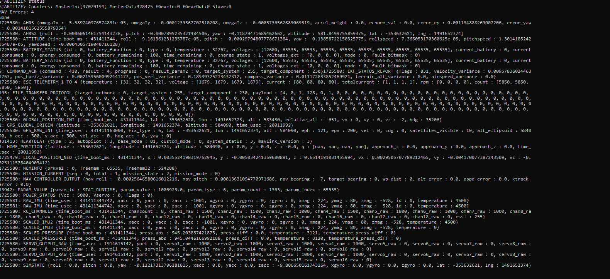
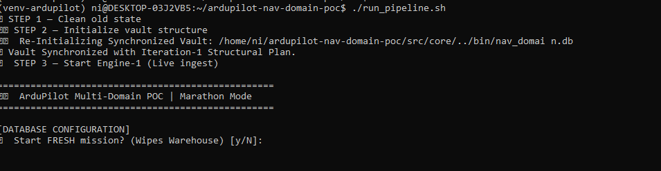
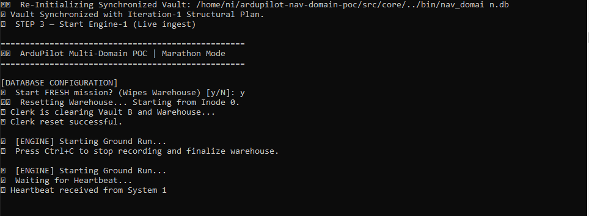
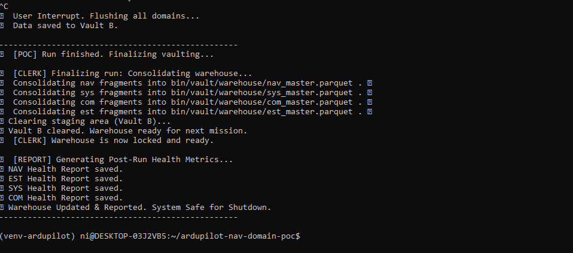
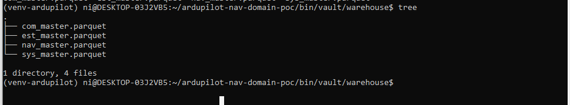
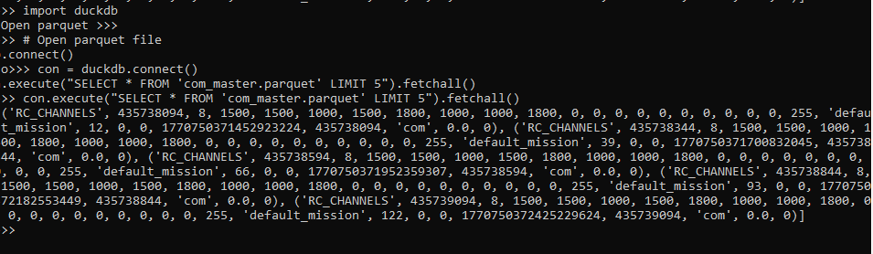
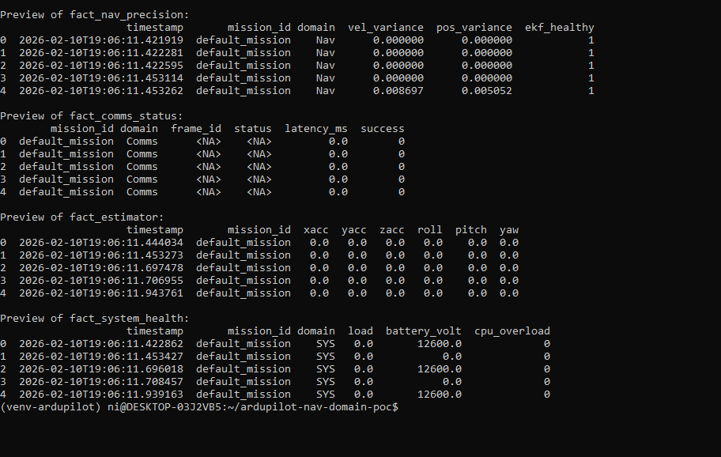
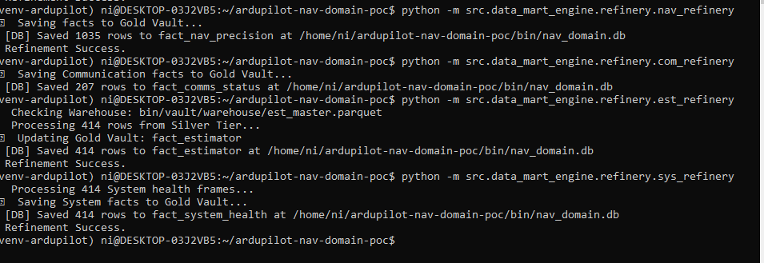

# **Navigation Domain POC — Multi-Domain Analytics**

---

## The Concept

In a standard SITL run, telemetry streams arrive as mixed MAVLink packets, including Navigation, System, and Sensor data. The packets come asynchronously and at different rates, all combined as a single stream providing a snapshot of the drone system status. The aim is to capture all MAVLink packets **without dropping any bytes** and organize them into structured **Domain Data Lakes** (time-aligned files), allowing developers to analyze each domain individually and see how domains interact with each other.

---

## The Problem

Current SITL runs provide a complete snapshot of all telemetry streams from Navigation, System, and Sensor domains in a mixed, asynchronous manner. Developers cannot easily examine how a single stream is performing or correlate it with other domains. This makes it difficult to evaluate estimator behavior, tune sensor parameters, or assess system performance across a flight.

---

## The Solution

The problem is addressed by capturing the incoming streams of packets. Once captured with almost zero loss, we perform **re-alignment in a staggered, two-stage approach**.

### First Stage-Engine-1

During the **initial run**, all incoming MAVLink packets are captured and separated by domain: Navigation → `nav.parquet`, System → `system.parquet`, Sensor → `sensor.parquet`. This allows developers to view each domain independently and understand basic behavior.

### Second Stage-Engine-2

During the **second run**, every packet is assigned a **Time-ID** using the file inode and a high-resolution timestamp. This temporal alignment prepares the data for detailed intra-domain and inter-domain analysis. Developers can now correlate events across domains, evaluate estimator performance, tune sensor parameters, and improve overall system behavior.

### Third Stage-Engine-3

During the SITL refinement run, data is captured and segregated for each domain and stored in master parquet files in the DuckDB database. Additionally, to obtain the drone perspective, the **DataFlash (.BIN) file is cleaned to remove noise, duplicates, and corrupt entries, and converted to a structured format through a separate DF run**. Both data sources — `domain_sitl_master.parquet` and `domain_df_master.parquet` — are then exposed as API services for scorecard generation and domain and multi-domain causal analysis through the domain dashboard.

---

## Benefit

This system makes it easier for developers to work with SITL telemetry by providing clear, structured data for analysis. Developers can:

* Analyze each domain individually and compare one domain against another to understand interactions and performance.
* Examine cross-domain correlations to spot issues or dependencies.
* Analyze runs in a repeatable way, reducing manual work and guesswork.
* Use simple queries to explore performance, fine-tune parameters, and validate estimators.

---

## Telemetry Snapshots

---

## Telemetry Snapshots in Sequence of Flow
## Telemetry Snapshots in Sequence of Flow
## Telemetry Snapshots in Sequence of Flow

          # raw MAVLink packets
  # SITL initial setup
            # periodic system heartbeat
 # mission end
  # domain_master.parquet files separated by domain
  # pre-refinement Parquet snapshot
       # preview of fact tables
     # refinement in action
   # final DB tables

