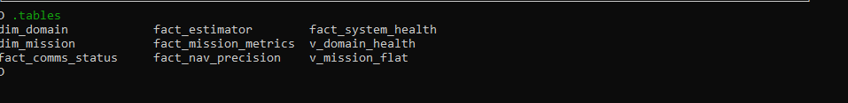

# Data Flash: DataFlash_Processing_Pipeline  — How It Actually Works

# Upon ingestion, a raw ArduPilot .BIN log is immediately cleaned and transformed into mission-aware Parquet files, which are then loaded into the DuckDB Warehouse and materialized into specialized Fact Tables—including fact_nav, fact_est, fact_sys, fact_power, and fact_communication.

# The 5-Step Processing Flow

## 1️⃣ Extraction — Convert BIN to Structured Data

**Command**
python3 src/runner/df_main.py

**What it does**
- Reads `.BIN` logs from: bin/vault/df_source/
- Splits raw binary messages into domain-based datasets:
- NAV
- SYS
- POW
- etc.

**Output**
bin/vault/vault_b/
Temporary `.parquet` shard files.

**Important**
- These files are intermediate.
- They do NOT yet have a Mission ID.
- Do not run refinement before this finishes.

---

## 2️⃣ Refinement — Add Identity & Time Alignment

**Command**
python3 bin/df_refinery.py

**What it does**
- Reads shard files from `vault_b`
- Generates a unique `MISSION_ID`
- Anchors timestamps to Time = 0
- Stamps every row with that ID

**Output**
bin/vault/warehouse_df/
Permanent Parquet master files.

**After this**
- `vault_b` is cleaned.
- Data is now mission-aware and stable.

---

## 3️⃣ Projection — Build SQL Tables

**Command**
python3 src/runner/create_views.py

**What it does**
- DuckDB reads Parquet masters
- Builds physical `fact_` tables
- Builds `view_` / `ui_` views

**Output**
bin/vault/warehouse_df/drone_df_views.db

Now the data is SQL-queryable. This database is the single source of truth.

---

## 4️⃣ Service — Start the API

**Command**
export PYTHONPATH=$PYTHONPATH:$(pwd)/src
python3 src/df_apis/df_api_server.py

**What it does**
- Starts FastAPI on port 8000
- Exposes endpoints like:
/forensic/missions
/domain/nav

The backend is now live.

---

## 5️⃣ UI — Start the Dashboard

**Command**

The backend is now live.

---

## 5️⃣ UI — Start the Dashboard

**Command**
cd engine3_dashboard
npm run dev

**What it does**
- Launches Svelte on port 5173
- Fetches data from FastAPI
- Displays historical flight data

Frontend depends entirely on the API being live.

---

# Operational Rules (Non-Negotiable)

### 1. Always Run From Project Root
All scripts assume correct root detection.

---

### 2. Never Run Extraction and Refinement Together
`df_main.py` must fully complete
before `df_refinery.py` runs.

---

### 3. Canonical Database
All queries must target:bin/vault/warehouse_df/drone_df_views.db

---

### 4. Naming Convention

| Type | Prefix |
|------|--------|
| Fact Tables | `fact_` |
| SQL Views | `view_` or `ui_` |

---

### 5. Mission ID Type
`MISSION_ID` is a **string**.

Example:MISSION_1739461234

Never treat it as an integer.

---

### 6. Live vs Historical

| Route | Data Source |
|-------|------------|
| `/sitl` | Live stream (socket-based) |
| `/drone` | Historical (DuckDB-based) |

---

# System Mental Model (Simple Version)
BIN file
↓
Structured Parquet
↓
Mission-stamped Masters
↓
DuckDB Tables
↓
FastAPI
↓
Svelte Dashboard

That’s the entire system.

No hidden paths.
No parallel pipelines.
No alternate databases.

---

**This document is the operational contract.**
If something breaks, start at Step 1 and verify each stage in order.

