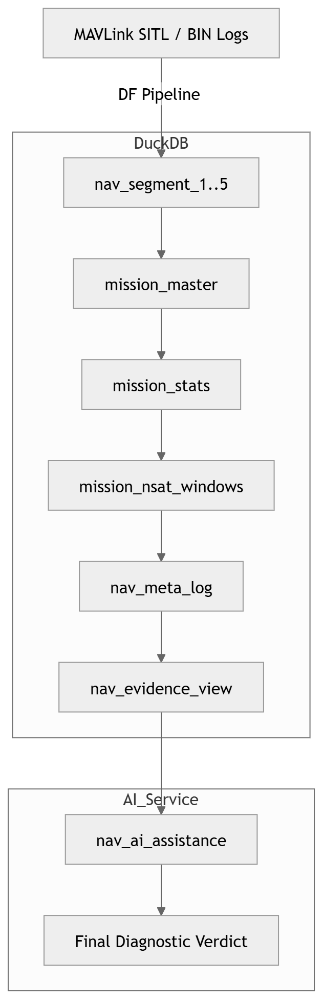

# NAV DataFlash Pipeline

This project captures ArduPilot `.BIN` file logs are segregated into domains (nav, est, power, sys and com) to answer;what, where and why it happened in the flight.Everything remains traceable back to the original telemetry.

---

## How the flow works

We start with the raw BIN log and move step by step:

BIN → ingestion → shards → NAV master → DuckDB → analysis → final output

First, the log is read using pymavlink and broken into domain-specific parquet shards (NAV, etc).
These are stored in `vault_b`. At this stage, nothing is modified — it's just structured.

Then we build a NAV master dataset.
Here we assign a `mission_id` and split the data into small partitions using `segment_id`.
This gives us a clean, queryable dataset.

From there, everything runs inside DuckDB.

## Architecture

## What happens in the database

The database is where the actual logic lives.

We combine all segments into a single `mission_master` table.
This is the full mission timeline.

From that, we create **windows** based on how the GPS signal (NSats) behaves over time.

A window is simply:
> a continuous period where the signal stays in the same state

Example:
NSats = 3 → 0 → 12 → 7 → 0 → 12

This naturally becomes multiple windows. No assumptions, just grouping what the signal already does.

These windows are stored in `mission_nsat_windows`.

---

## Turning data into meaning

Once we have windows:

- `rule_master` defines what different signal conditions mean
- `nav_meta_log` stores exact anchors (where to look in the data)
- the service layer reads these anchors and pulls the actual telemetry slice

Then we run a simple pipeline:

window → check → stats → label → verdict

And store the result in:
`nav_ai_assistance`

This final table is the answer layer — it contains:
- what was detected
- supporting data
- explanation

---

## core

We **separate signal from interpretation**:

- windows = what actually happened
- rules = what it means

This keeps everything:
- deterministic
- explainable
- reusable

---

## How to run

Right now, the pipeline starts from the main DataFlash runner.

Step 1 — Run ingestion + base pipeline

python3 src/runner/df_main.py

This reads the BIN log and prepares the initial dataset.

Step 2 — Build Shards(parquet files) and convert them into dataset segments (duckdb)

create_domain_master_db.sh

This assigns mission_id and creates the partitioned NAV dataset.

Step 3 — Run analysis pipeline (SQL + AI builder)

This includes:
- building mission tables (mission_master, windows, meta log)
- running the AI assistance builder

nav_ai_assistance_builder.py

---

Note:
The pipeline is being simplified, and in future versions this will be unified into a single entry point.