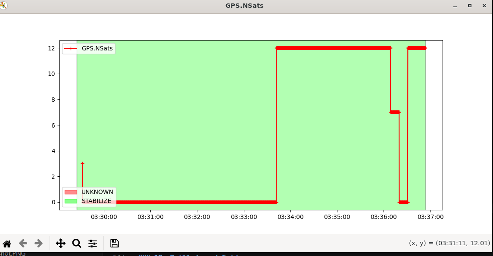
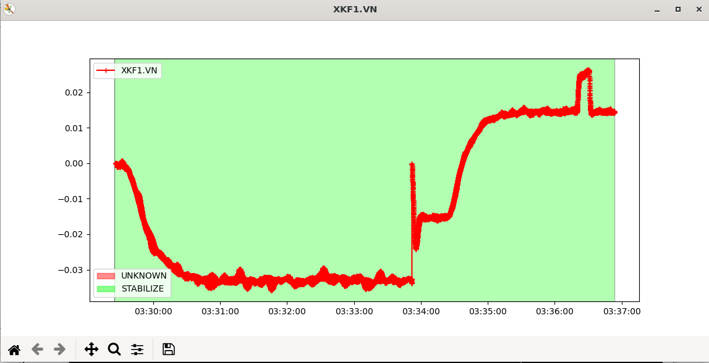
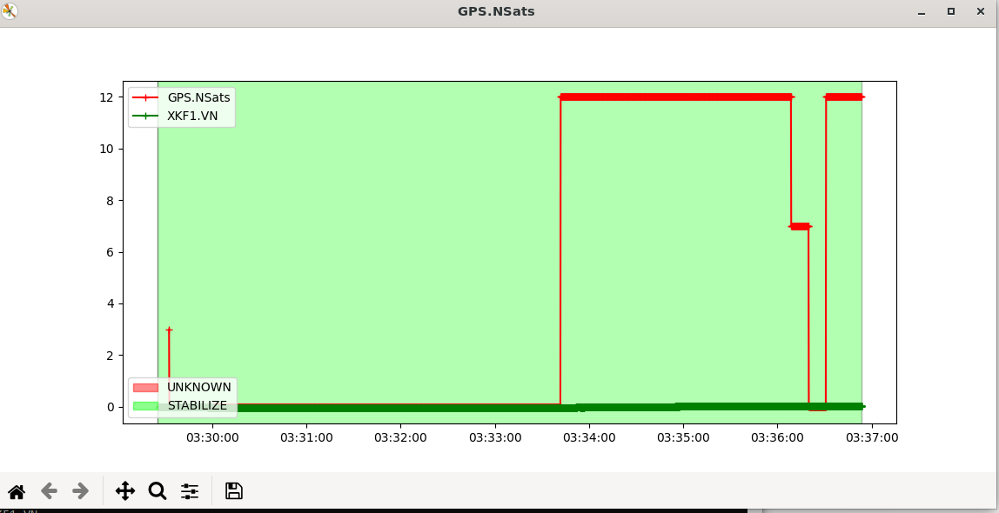
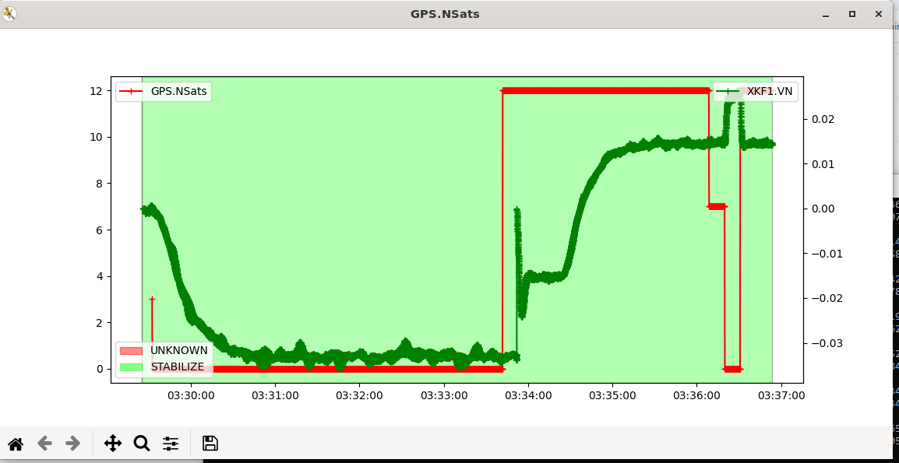
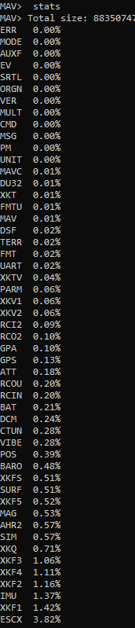
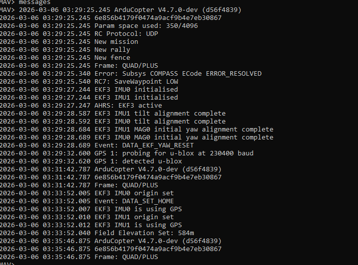

# MAVExplorer Experimental Evidence

This section contains the direct experimental evidence supporting the observations recorded in the MAVExplorer evaluation.

The evidence is intentionally kept separate from interpretation. Screenshots, console output, decoded records, and source-level observations are reproduced or referenced first; conclusions are recorded afterward.

---

## Evidence 1 — MAVExplorer Command Interface

### Command

```text
MAV> help graph
MAV> graph : display a graph
```

### Evidence

The MAVExplorer command interface exposes a `graph` command for telemetry visualization.

### Establishes

MAVExplorer provides a command-line `graph` facility for telemetry visualization.

---

## Evidence 2 — Single-Field Graph: GPS.NSats

### Command

```text
MAV> graph GPS.NSats
```

### Evidence



**Evidence artifact:** `evidence/E02_gps_nsats_graph.png`

### Observation

The graph displays `GPS.NSats` against the log timeline.

Observed satellite-count behaviour:

```text
approximately 12 satellites
        ↓
approximately 0
        ↓
recovery
        ↓
approximately 0
        ↓
recovery
```

### Establishes

MAVExplorer can directly plot an individual DataFlash field against time.

---

## Evidence 3 — Single-Field Graph: XKF1.VN

### Command

```text
MAV> graph XKF1.VN
```

### Evidence



**Evidence artifact:** `evidence/E03_xkf1_vn_graph.png`

### Observation

`XKF1.VN` is displayed as a time-series signal with values in the small velocity range observed in this dataset.

### Establishes

MAVExplorer can independently visualize estimator telemetry.

---

## Evidence 4 — Multi-Parameter Graph

### Command

```text
MAV> graph GPS.NSats XKF1.VN
```

### Evidence



**Evidence artifact:** `evidence/E04_gps_nsats_xkf1_vn.png`

### Observation

Both fields are displayed in the same graph using a common time axis.

Because the two signals have substantially different numerical ranges, `XKF1.VN` is visually compressed when both are placed on the same scale.

### Establishes

MAVExplorer supports multi-parameter visualization across different DataFlash message types.

---

## Evidence 5 — Secondary Y-Axis

### Command

```text
MAV> graph GPS.NSats XKF1.VN:2
```

### Evidence



**Evidence artifact:** `evidence/E05_gps_nsats_xkf1_vn_dual_axis.png`

### Observation

The graph displays:

- `GPS.NSats` using the primary Y-axis.
- `XKF1.VN` using a secondary Y-axis.
- Both signals remain aligned on the same time axis.

### Establishes

MAVExplorer supports secondary-axis plotting through the `:2` command syntax.

---

## Evidence 6 — Message Statistics

### Command

```text
MAV> stats
```

### Evidence



**Evidence artifact:** `evidence/E06_stats.png`

The complete text output is retained separately:

[E06_stats.txt](./evidence/E06_stats.txt)

### Relevant observed output

```text
GPS   0.13%
ATT   0.18%
BAT   0.21%
VIBE  0.28%
IMU   1.37%
XKF1  1.42%
XKF2  1.16%
XKF3  1.06%
...
```

and:

```text
@EKF3      6.66%
@SENSORS   1.97%
@RC        0.40%
@TUNING    55.45%
@SYSTEM    0.22%
@OTHER     35.30%
```

### Establishes

MAVExplorer/MAVProxy provides message-frequency/statistical information and predefined message categories.

---

## Evidence 7 — MAVProxy Category Definition

### Source

```text
MAVProxy.modules.lib.msgstats
```

### Source location observed

```text
/home/ni/ardupilot/venv-ardupilot/lib/python3.12/site-packages/MAVProxy/modules/lib/msgstats.py
```

### Relevant implementation evidence

```text
categories = {
    'EKF2': ['NK*'],
    'EKF3': ['XK*'],
    'SENSORS': ['IMU*', 'BAR*', 'GPS*', 'RFND', 'ACC', 'GYR'],
    'RC': ['RCIN', 'RCOU'],
    'TUNING': ['RATE', 'PID*', 'CTUN', 'NTUN', 'ATT', 'PSC'],
    'SYSTEM': ['MAV', 'BAT*', 'EV', 'CMD', 'MODE'],
    ...
}
```

### Observation

The category information is not merely an interpretation made by us from the `stats` output.

Predefined category mappings exist in the installed MAVProxy implementation.

### Establishes

The category information is implemented in the existing MAVProxy source rather than being inferred solely from the observed statistics.

This is evidence that the existing tool already provides an organizational layer above individual DataFlash message names.

---

## Evidence 8 — GPS Raw Record / FMT Structure

### FMT Evidence

```text
FMT {
    Type : 11,
    Length : 60,
    Name : GPS,
    Format : BIHBcLLeeeEHBh,
    Columns : TimeUS,I,Status,GMS,GWk,NSats,HDop,Lat,Lng,Alt,Spd,GCrs,VZ,Yaw
}
```

### Evidence

The `GPS` DataFlash message contains structural information describing its encoding and fields.

Relevant fields include:

```text
TimeUS
I
Status
GMS
GWk
NSats
HDop
Lat
Lng
Alt
Spd
GCrs
VZ
Yaw
```

### Establishes

The DataFlash log contains structural information describing how the `GPS` record is encoded and which fields are present.

---

## Evidence 9 — GPS Record

### Command

```text
MAV> dump GPS
```

### Evidence

The decoded GPS record output is retained as a text evidence artifact:

[E09 — GPS dump](./evidence/E09_gps_dump.txt)

### Relevant fields

```text
GPS
 ├── Status
 ├── NSats
 ├── HDop
 ├── Lat
 ├── Lng
 ├── Alt
 ├── Spd
 ├── GCrs
 └── ...
```

### Establishes

MAVExplorer can expose decoded DataFlash records as field/value observations.

---

## Evidence 10 — EKF Record

### Command

```text
MAV> dump XKF1
```

### Evidence

The decoded XKF1 record output is retained as a text evidence artifact:

[E10 — XKF1 dump](./evidence/E10_xkf1_dump.txt)

### Relevant fields

```text
XKF1
 ├── Roll
 ├── Pitch
 ├── Yaw
 ├── VN
 ├── VE
 ├── VD
 ├── PN
 ├── PE
 ├── PD
 └── ...
```

### Establishes

MAVExplorer can expose decoded estimator records independently from GPS records.

---

## Evidence 11 — Event / MSG Records

### Evidence



**Evidence artifact:** `evidence/E11_messages.png`

Observed event messages included:

```text
GPS 1: probing for u-blox at 230400 baud
GPS 1: detected u-blox

EKF3 IMU0 origin set
Event: DATA_SET_HOME
EKF3 IMU0 is using GPS

EKF3 IMU1 origin set
EKF3 IMU1 is using GPS
```

### Establishes

The log contains explicit event information in addition to numerical telemetry.

---

# Evidence-to-Finding Matrix

| Evidence | Directly demonstrates | Research relevance |
|---|---|---|
| E1 | Graph command exists | Analyst access |
| E2 | GPS field plotting | Sensor observation |
| E3 | EKF field plotting | Estimator observation |
| E4 | Multiple signals on one graph | Cross-signal visualization |
| E5 | Secondary Y-axis | Heterogeneous signal visualization |
| E6 | Message statistics/categories | Existing organization |
| E7 | Category implementation | Source-level confirmation |
| E8 | FMT structure | DataFlash structural decoding |
| E9 | GPS decoded records | Raw observation access |
| E10 | EKF decoded records | Estimator observation access |
| E11 | Event records | Event-level evidence |

---

# What the Evidence Does NOT Establish

The experiments above do **not** by themselves establish that MAVExplorer:

- automatically diagnoses GPS failures;
- automatically determines root cause;
- automatically correlates GPS and EKF events;
- automatically assigns engineering significance to every value;
- automatically creates a complete NAV/EST/COM/SYSTEM/POWER diagnostic model;
- or lacks all forms of semantic information internally.

Those questions require separate experiments.

Therefore, these conclusions should not be added to the report until directly tested.

---

# Current Evidence-Based Conclusion

The evidence establishes that MAVExplorer provides a capable developer-oriented interface for:

```text
DataFlash BIN
     ↓
decode
     ↓
message / field
     ↓
statistics
     ↓
graph
     ↓
multi-signal graph
     ↓
secondary-axis visualization
     ↓
decoded record inspection
     ↓
event/message inspection
```

The remaining research question is what happens **between these observations and a reproducible diagnosis**.

That is the boundary where the `ardunav` investigation becomes relevant.

---

# Analysis of Evidence

The experiments demonstrate that MAVExplorer is substantially more capable than a simple log viewer.

It provides:

- DataFlash decoding
- field-level inspection
- single-field plotting
- multi-field plotting
- common time-axis visualization
- secondary-axis visualization
- message statistics
- predefined message categories
- decoded record inspection
- access to event information

Therefore, the research question is not whether MAVExplorer can display telemetry.

It clearly can.

The next question is whether the information exposed by these facilities is sufficient to support a reproducible, domain-oriented diagnostic workflow without requiring the engineer to manually assemble the evidence.

The experiments therefore move from:

`Can the tool display the data?`

to:

`How much reasoning and evidence assembly remains with the developer?`

---

# Evidence Repository Structure

The evidence used by this report is stored alongside the report:

```text
docs/phd/log_analysis_tools/
├── MAVEXPLORER.md
├── MAVEXPLORER.md.bak
└── evidence/
    ├── E02_gps_nsats_graph.png
    ├── E03_xkf1_vn_graph.png
    ├── E04_gps_nsats_xkf1_vn.png
    ├── E05_gps_nsats_xkf1_vn_dual_axis.png
    ├── E06_stats.png
    ├── E06_stats.txt
    ├── E09_gps_dump.txt
    ├── E10_xkf1_dump.txt
    └── E11_messages.png
```

The PNG evidence is embedded directly in the corresponding Evidence sections using repository-relative paths:

```text
./evidence/E02_gps_nsats_graph.png
./evidence/E03_xkf1_vn_graph.png
./evidence/E04_gps_nsats_xkf1_vn.png
./evidence/E05_gps_nsats_xkf1_vn_dual_axis.png
./evidence/E06_stats.png
./evidence/E11_messages.png
```

The text evidence is linked directly:

```text
./evidence/E06_stats.txt
./evidence/E09_gps_dump.txt
./evidence/E10_xkf1_dump.txt
```

